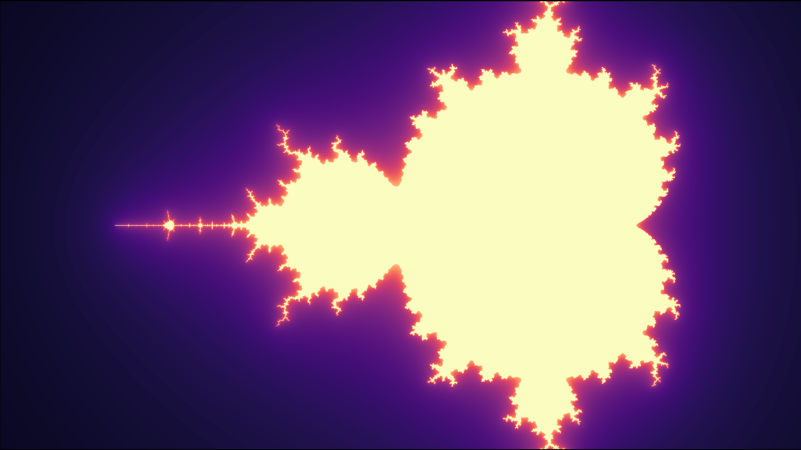
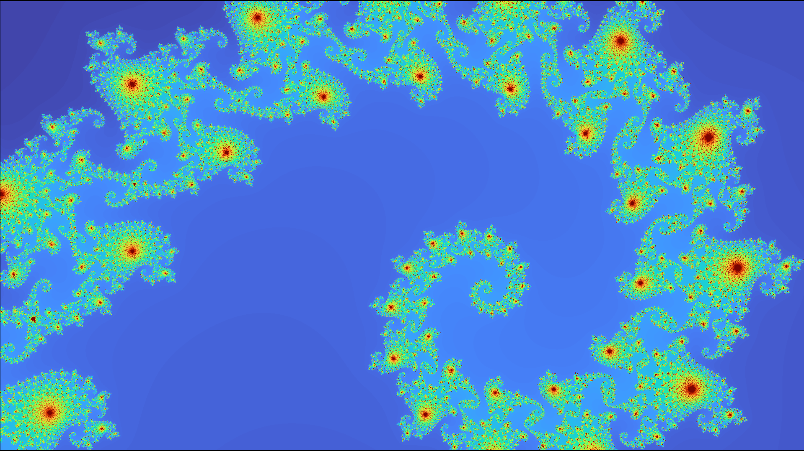
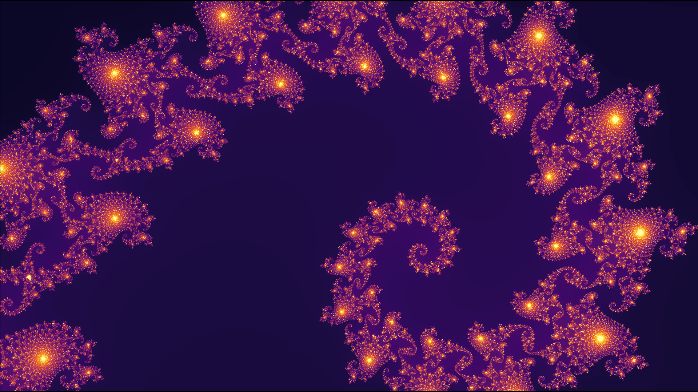
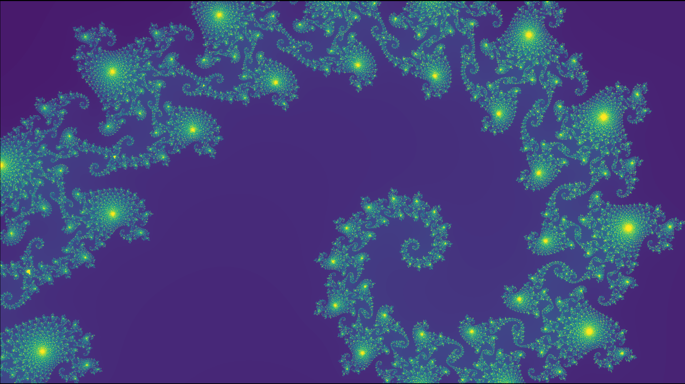

# Generating the Mandelbrot Set in Python
## Overview

## Examples

*Full Mandelbrot Set with twilight color palette and smoothing disabled*

*Full Mandelbrot Set with magma color palette and smoothing enabled*

*Mandelbrot spiral with turbo color palette and smoothing disabled*

*Mandelbrot spiral with inferno color palette and smoothing enabled*

*Mandelbrot spiral with viridis color palette and smoothing disabled*
